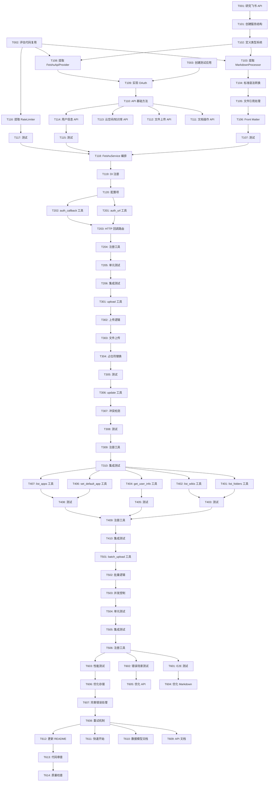

# Implementation Tasks: 飞书 Markdown MCP 服务

**Feature**: 001-feishu-markdown-mcp-service
**Created**: 2025-01-15
**Status**: Ready for Implementation

## Overview

本文档定义了实现飞书 Markdown MCP 服务的详细任务列表。任务按照实现阶段组织，每个任务包含明确的验收标准和文件路径。

## Task Format

```
- [ ] [TaskID] [P?] [Story?] Description
  Files: path/to/file.ts
  Details: Additional context
```

- `[P]`: 可并行执行的任务
- `[USx]`: 关联的用户故事编号
- TaskID: T001, T002...

## MVP Scope

MVP 包含以下核心功能（标记为 P0 和 P1 优先级）：
- ✅ OAuth 认证流程 (US2)
- ✅ Markdown 文档上传 (US1)
- ✅ 本地文件上传 (US3)
- ✅ 知识库支持 (US4)
- ⚠️ 文档更新功能 (US6) - 部分功能
- ❌ 扩展语法支持 (US5) - 后续版本
- ❌ 代码块过滤 (US7) - 后续版本
- ❌ 批量上传 (US8) - 后续版本

---

## Phase 0: 准备和研究 (1-2 days)

**Goal**: 完成技术调研，确定实现方案，设置开发环境

**Independent Test**: 
1. 研究文档完整且准确
2. 测试飞书应用创建成功并获得凭证
3. 能够手动调用飞书 API 验证权限


### Research Tasks

- [x] [T001] [P] 研究飞书开放平台 API 文档
  Files: .kiro/specs/001-feishu-markdown-mcp-service/research.md
  Details: 
  - 研究 OAuth 2.0 认证流程和端点
  - 研究文档 API（创建、更新、获取）
  - 研究文件上传 API（图片、附件）
  - 研究云空间和知识库 API
  - 记录 API 限制和最佳实践
  - 确定需要的应用权限范围

- [x] [T002] [P] 评估 feishushare 代码可复用性
  Files: .kiro/specs/001-feishu-markdown-mcp-service/research.md
  Details:
  - 分析 MarkdownProcessor 核心逻辑
  - 分析 FeishuApiService API 调用模式
  - 分析 RateLimitController 频率控制逻辑
  - 识别 Obsidian 依赖项
  - 确定需要重构的部分

- [x] [T003] [P] 创建测试飞书应用
  Files: .env.example
  Details:
  - 在飞书开放平台创建测试应用
  - 配置应用权限（文档、云空间、知识库）
  - 获取 App ID 和 App Secret
  - 配置 OAuth 回调 URL
  - 测试应用凭证有效性

- [x] [T004] 完成 research.md 文档
  Files: .kiro/specs/001-feishu-markdown-mcp-service/research.md
  Details:
  - 记录所有研究发现
  - 记录技术决策和理由
  - 记录 API 限制和约束
  - 提供代码示例和参考链接

---

## Phase 1: 核心服务层 (3-4 days)

**Goal**: 实现飞书服务的核心逻辑层，包括 Markdown 处理、API 调用、频率限制

**Independent Test**:
1. MarkdownProcessor 能够正确转换标准 Markdown 语法
2. FeishuApiProvider 能够成功调用飞书 API（使用 mock）
3. RateLimiter 能够正确控制调用频率
4. 所有服务通过单元测试

### Service Infrastructure

- [ ] [T101] [US1] 创建 Feishu 服务目录结构
  Files: 
  - src/services/feishu/core/IFeishuProvider.ts
  - src/services/feishu/core/FeishuService.ts
  - src/services/feishu/providers/.gitkeep
  - src/services/feishu/types.ts
  - src/services/feishu/index.ts
  Details:
  - 创建标准服务目录结构（遵循 AGENTS.md）
  - 定义 IFeishuProvider 接口
  - 创建 FeishuService 编排器骨架
  - 定义基础类型（FeishuConfig, FeishuAuth 等）

- [ ] [T102] [US1] 定义 Feishu 服务类型系统
  Files: src/services/feishu/types.ts
  Details:
  - 定义 MarkdownDocument 类型
  - 定义 FeishuDocument 类型
  - 定义 LocalFile 类型
  - 定义 FeishuAuth 类型
  - 定义 UploadConfig 类型
  - 定义 API 请求/响应类型
  - 所有类型需要 JSDoc 注释


### Markdown Processing

- [ ] [T103] [US1] 提取并适配 MarkdownProcessor
  Files: src/services/feishu/providers/markdown-processor.provider.ts
  Details:
  - 从 feishushare/src/markdown-processor.ts 提取核心逻辑
  - 移除 Obsidian 依赖（App, TFile, normalizePath）
  - 使用 Node.js 标准 API（fs, path）
  - 实现 @injectable() 装饰器
  - 实现 IFeishuProvider 接口
  - 添加 healthCheck() 方法

- [ ] [T104] [US1] 实现标准 Markdown 语法转换
  Files: src/services/feishu/providers/markdown-processor.provider.ts
  Details:
  - 标题 → Heading Block
  - 段落 → Text Block
  - 列表 → Bullet/Ordered List Block
  - 代码块 → Code Block
  - 引用 → Quote Block
  - 表格 → Table Block
  - 链接 → Text Block with link
  - 粗体/斜体 → Text Style

- [ ] [T105] [US1] 实现本地文件引用处理
  Files: src/services/feishu/providers/markdown-processor.provider.ts
  Details:
  - 识别图片引用（ 和 ![[image]]）
  - 识别附件引用
  - 解析相对路径和绝对路径
  - 生成占位符用于后续替换
  - 返回 LocalFile 列表

- [ ] [T106] [US1] 实现 Front Matter 处理
  Files: src/services/feishu/providers/markdown-processor.provider.ts
  Details:
  - 使用 frontmatterParser 解析 Front Matter
  - 支持移除或保留 Front Matter
  - 提取标题（如果 Front Matter 中有）

- [ ] [T107] [US1] 编写 MarkdownProcessor 单元测试
  Files: tests/unit/services/feishu/markdown-processor.test.ts
  Details:
  - 测试标准 Markdown 语法转换
  - 测试本地文件引用识别
  - 测试 Front Matter 处理
  - 测试边界情况（空文档、特殊字符等）
  - 目标覆盖率 > 80%

### API Provider

- [ ] [T108] [US2] 提取并适配 FeishuApiProvider
  Files: src/services/feishu/providers/feishu-api.provider.ts
  Details:
  - 从 feishushare/src/feishu-api.ts 提取核心逻辑
  - 移除 Obsidian Notice 和 UI 相关代码
  - 使用 axios 替代 requestUrl
  - 实现 @injectable() 装饰器
  - 实现 IFeishuProvider 接口
  - 添加 healthCheck() 方法

- [ ] [T109] [US2] 实现 OAuth 2.0 认证逻辑
  Files: src/services/feishu/providers/feishu-api.provider.ts
  Details:
  - 生成授权 URL（包含 state 参数）
  - 处理授权回调（交换 code 获取 token）
  - 实现 token 刷新逻辑
  - 实现 token 过期检测
  - 使用 StorageService 存储 token（加密）

- [ ] [T110] [US2] 实现飞书 API 基础调用方法
  Files: src/services/feishu/providers/feishu-api.provider.ts
  Details:
  - 实现 HTTP 请求封装（GET, POST, PUT, DELETE）
  - 实现请求头构建（Authorization, Content-Type）
  - 实现响应解析和错误处理
  - 实现自动 token 刷新
  - 实现重试机制（最多 3 次）


- [ ] [T111] [US1] 实现文档操作 API 方法
  Files: src/services/feishu/providers/feishu-api.provider.ts
  Details:
  - createDocument(title, blocks, targetType, targetId)
  - updateDocument(documentId, blocks)
  - getDocument(documentId)
  - getDocumentMeta(documentId) - 获取最后修改时间

- [ ] [T112] [US3] 实现文件上传 API 方法
  Files: src/services/feishu/providers/feishu-api.provider.ts
  Details:
  - uploadImage(filePath) → imageKey
  - uploadFile(filePath, fileType) → fileKey
  - 支持 multipart/form-data
  - 处理文件大小限制
  - 处理文件类型检测

- [ ] [T113] [US4] 实现云空间和知识库 API 方法
  Files: src/services/feishu/providers/feishu-api.provider.ts
  Details:
  - listFolders(parentId?) → Folder[]
  - listWikis() → Wiki[]
  - getWikiNodes(wikiId) → Node[]

- [ ] [T114] [US2] 实现用户信息 API 方法
  Files: src/services/feishu/providers/feishu-api.provider.ts
  Details:
  - getUserInfo() → UserInfo
  - 包含 userId, name, email, avatarUrl

- [ ] [T115] [US2] 编写 FeishuApiProvider 单元测试
  Files: tests/unit/services/feishu/feishu-api.test.ts
  Details:
  - Mock axios 请求
  - 测试 OAuth 流程
  - 测试 API 调用方法
  - 测试错误处理和重试
  - 测试 token 刷新
  - 目标覆盖率 > 80%

### Rate Limiting

- [ ] [T116] [P] 提取并适配 RateLimiter
  Files: src/services/feishu/providers/rate-limiter.provider.ts
  Details:
  - 从 feishushare/src/feishu-api.ts 提取 RateLimitController
  - 实现 @injectable() 装饰器
  - 实现滑动窗口算法
  - 支持配置限制参数（90次/分钟）
  - 实现智能节流和回退

- [ ] [T117] [P] 编写 RateLimiter 单元测试
  Files: tests/unit/services/feishu/rate-limiter.test.ts
  Details:
  - 测试频率限制逻辑
  - 测试滑动窗口算法
  - 测试并发场景
  - 目标覆盖率 > 80%

### Service Orchestration

- [ ] [T118] 实现 FeishuService 编排器
  Files: src/services/feishu/core/FeishuService.ts
  Details:
  - 注入 FeishuApiProvider, MarkdownProcessor, RateLimiter
  - 实现高层业务逻辑编排
  - 实现多应用配置管理
  - 实现错误处理和日志记录
  - 使用 appContext 进行日志记录

- [ ] [T119] 配置 DI 容器注册
  Files: 
  - src/container/tokens.ts
  - src/container/registrations/feishu.ts
  Details:
  - 添加 Feishu 服务相关 token
  - 注册 FeishuApiProvider
  - 注册 MarkdownProcessor
  - 注册 RateLimiter
  - 注册 FeishuService

- [ ] [T120] 添加飞书配置项
  Files: src/config/index.ts
  Details:
  - FEISHU_DEFAULT_APP_ID
  - FEISHU_DEFAULT_APP_SECRET
  - FEISHU_OAUTH_CALLBACK_URL
  - FEISHU_API_BASE_URL
  - FEISHU_RATE_LIMIT_ENABLED
  - FEISHU_MAX_RETRIES
  - FEISHU_RETRY_DELAY_MS
  - 使用 Zod schema 验证

---

## Phase 2: OAuth 认证 (2-3 days)

**Goal**: 实现完整的 OAuth 2.0 认证流程，包括授权、回调、token 管理

**Independent Test**:
1. 能够生成有效的授权 URL
2. 能够处理授权回调并获取 token
3. Token 能够正确存储和刷新
4. 认证流程端到端测试通过


### OAuth Tools

- [ ] [T201] [US2] 实现 feishu_auth_url 工具
  Files: src/mcp-server/tools/definitions/feishu-auth-url.tool.ts
  Details:
  - 定义 ToolDefinition
  - inputSchema: appId (optional), redirectUri (optional)
  - outputSchema: authUrl, state
  - logic: 调用 FeishuService 生成授权 URL
  - annotations: readOnlyHint: true
  - responseFormatter: 返回 Markdown 格式的授权链接

- [ ] [T202] [US2] 实现 feishu_auth_callback 工具
  Files: src/mcp-server/tools/definitions/feishu-auth-callback.tool.ts
  Details:
  - 定义 ToolDefinition
  - inputSchema: code, state, appId (optional)
  - outputSchema: success, userInfo, expiresAt
  - logic: 调用 FeishuService 处理回调
  - 验证 state 参数
  - 存储 token 到 StorageService
  - annotations: destructiveHint: false

- [ ] [T203] [US2] 添加 HTTP 传输 OAuth 回调路由
  Files: src/mcp-server/transports/http/httpTransport.ts
  Details:
  - 添加 GET /oauth/callback 路由
  - 解析 query 参数（code, state）
  - 调用 feishu_auth_callback 工具逻辑
  - 返回友好的 HTML 页面（成功/失败）
  - 处理错误情况

- [ ] [T204] [US2] 注册 OAuth 工具
  Files: src/mcp-server/tools/definitions/index.ts
  Details:
  - 导入 feishu_auth_url
  - 导入 feishu_auth_callback
  - 添加到 allToolDefinitions

- [ ] [T205] [US2] 编写 OAuth 工具单元测试
  Files: tests/unit/mcp-server/tools/feishu/auth.test.ts
  Details:
  - 测试 feishu_auth_url 输入验证
  - 测试授权 URL 生成
  - 测试 feishu_auth_callback 逻辑
  - 测试 state 验证
  - 测试错误处理
  - 目标覆盖率 > 80%

- [ ] [T206] [US2] 编写 OAuth 集成测试
  Files: tests/integration/feishu/oauth.test.ts
  Details:
  - 测试完整 OAuth 流程（使用测试应用）
  - 测试 token 存储和读取
  - 测试 token 刷新
  - 测试多应用配置

---

## Phase 3: 文档操作工具 (3-4 days)

**Goal**: 实现文档上传、更新、文件处理等核心功能

**Independent Test**:
1. 能够成功上传 Markdown 文档到飞书
2. 本地文件（图片、附件）能够正确上传
3. 文档更新功能正常工作
4. 冲突检测机制有效

### Upload Tool

- [ ] [T301] [US1] 实现 feishu_upload_markdown 工具
  Files: src/mcp-server/tools/definitions/feishu-upload-markdown.tool.ts
  Details:
  - 定义 ToolDefinition
  - inputSchema: 
    - filePath (optional)
    - content (optional)
    - workingDirectory (optional)
    - targetType (drive/wiki)
    - targetId (optional)
    - appId (optional)
    - uploadImages (boolean, default: true)
    - uploadAttachments (boolean, default: true)
    - removeFrontMatter (boolean, default: true)
  - outputSchema: documentId, url, title, uploadedFiles
  - logic: 编排完整上传流程
  - annotations: destructiveHint: false


- [ ] [T302] [US1] 实现上传工具核心逻辑
  Files: src/mcp-server/tools/definitions/feishu-upload-markdown.tool.ts
  Details:
  - 验证输入参数（filePath 或 content 必须提供一个）
  - 确定基准目录（baseDirectory）
  - 调用 MarkdownProcessor 转换文档
  - 处理本地文件上传（如果启用）
  - 替换文档中的文件占位符
  - 调用 FeishuApiProvider 创建文档
  - 存储文档元数据（documentId, lastUploadedAt）
  - 返回结果

- [ ] [T303] [US3] 实现文件上传逻辑
  Files: src/services/feishu/core/FeishuService.ts
  Details:
  - uploadLocalFiles(files: LocalFile[], appId) → Map<placeholder, key>
  - 遍历文件列表
  - 检查文件是否存在
  - 检查文件大小限制
  - 调用 FeishuApiProvider 上传
  - 使用 RateLimiter 控制频率
  - 处理上传失败（记录警告，继续处理）
  - 返回占位符到文件 key 的映射

- [ ] [T304] [US1] 实现文档块替换逻辑
  Files: src/services/feishu/core/FeishuService.ts
  Details:
  - replaceFilePlaceholders(blocks, fileKeyMap)
  - 遍历文档块
  - 查找图片占位符
  - 替换为飞书文件 key
  - 处理未上传的文件（保留原始文本或移除）

- [ ] [T305] [US1] 编写上传工具单元测试
  Files: tests/unit/mcp-server/tools/feishu/upload.test.ts
  Details:
  - 测试输入验证
  - 测试文件路径模式
  - 测试内容模式
  - 测试文件上传开关
  - 测试错误处理
  - Mock FeishuService
  - 目标覆盖率 > 80%

### Update Tool

- [ ] [T306] [US6] 实现 feishu_update_document 工具
  Files: src/mcp-server/tools/definitions/feishu-update-document.tool.ts
  Details:
  - 定义 ToolDefinition
  - inputSchema:
    - documentId (required)
    - filePath (optional)
    - content (optional)
    - workingDirectory (optional)
    - appId (optional)
    - uploadImages (boolean, default: true)
    - uploadAttachments (boolean, default: true)
    - removeFrontMatter (boolean, default: true)
    - force (boolean, default: false)
  - outputSchema: success, documentId, url, conflictDetected
  - logic: 编排更新流程
  - annotations: destructiveHint: true

- [ ] [T307] [US6] 实现冲突检测逻辑
  Files: src/services/feishu/core/FeishuService.ts
  Details:
  - 从 StorageService 读取 lastUploadedAt
  - 调用 FeishuApiProvider.getDocumentMeta() 获取 updatedAt
  - 比较时间戳
  - 如果 updatedAt > lastUploadedAt 且 force=false，抛出冲突错误
  - 如果 force=true 或无冲突，继续更新
  - 更新成功后，更新 lastUploadedAt

- [ ] [T308] [US6] 编写更新工具单元测试
  Files: tests/unit/mcp-server/tools/feishu/update.test.ts
  Details:
  - 测试正常更新流程
  - 测试冲突检测
  - 测试强制覆盖
  - 测试文档不存在情况
  - Mock FeishuService
  - 目标覆盖率 > 80%

### Tool Registration

- [ ] [T309] 注册文档操作工具
  Files: src/mcp-server/tools/definitions/index.ts
  Details:
  - 导入 feishu_upload_markdown
  - 导入 feishu_update_document
  - 添加到 allToolDefinitions

- [ ] [T310] 编写文档操作集成测试
  Files: tests/integration/feishu/document-operations.test.ts
  Details:
  - 测试完整上传流程（包含文件）
  - 测试文档更新流程
  - 测试冲突检测
  - 使用真实的测试应用和测试文档

---

## Phase 4: 管理工具 (2-3 days)

**Goal**: 实现云空间、知识库、用户信息、应用配置等管理功能

**Independent Test**:
1. 能够列出云空间文件夹
2. 能够列出知识库空间
3. 能够获取用户信息
4. 能够管理多应用配置


### Drive and Wiki Tools

- [ ] [T401] [US4] 实现 feishu_list_folders 工具
  Files: src/mcp-server/tools/definitions/feishu-list-folders.tool.ts
  Details:
  - 定义 ToolDefinition
  - inputSchema: parentId (optional), appId (optional)
  - outputSchema: folders[] (id, name, parentId, createdAt)
  - logic: 调用 FeishuApiProvider.listFolders()
  - annotations: readOnlyHint: true
  - responseFormatter: 使用 tableFormatter 格式化文件夹列表

- [ ] [T402] [US4] 实现 feishu_list_wikis 工具
  Files: src/mcp-server/tools/definitions/feishu-list-wikis.tool.ts
  Details:
  - 定义 ToolDefinition
  - inputSchema: appId (optional)
  - outputSchema: wikis[] (id, name, description, createdAt)
  - logic: 调用 FeishuApiProvider.listWikis()
  - annotations: readOnlyHint: true
  - responseFormatter: 使用 tableFormatter 格式化知识库列表

- [ ] [T403] [P] 编写 Drive/Wiki 工具单元测试
  Files: tests/unit/mcp-server/tools/feishu/drive-wiki.test.ts
  Details:
  - 测试 feishu_list_folders
  - 测试 feishu_list_wikis
  - Mock FeishuService
  - 目标覆盖率 > 80%

### User Info Tool

- [ ] [T404] [US2] 实现 feishu_get_user_info 工具
  Files: src/mcp-server/tools/definitions/feishu-get-user-info.tool.ts
  Details:
  - 定义 ToolDefinition
  - inputSchema: appId (optional)
  - outputSchema: userId, name, email, avatarUrl
  - logic: 调用 FeishuApiProvider.getUserInfo()
  - annotations: readOnlyHint: true
  - responseFormatter: 格式化用户信息

- [ ] [T405] [P] 编写用户信息工具单元测试
  Files: tests/unit/mcp-server/tools/feishu/user-info.test.ts
  Details:
  - 测试 feishu_get_user_info
  - 测试未认证情况
  - Mock FeishuService
  - 目标覆盖率 > 80%

### App Configuration Tools

- [ ] [T406] 实现 feishu_set_default_app 工具
  Files: src/mcp-server/tools/definitions/feishu-set-default-app.tool.ts
  Details:
  - 定义 ToolDefinition
  - inputSchema: appId (required)
  - outputSchema: success, appId
  - logic: 
    - 验证 appId 是否已配置（检查 token 是否存在）
    - 存储到 StorageService (feishu:config:default_app)
  - annotations: destructiveHint: false

- [ ] [T407] 实现 feishu_list_apps 工具
  Files: src/mcp-server/tools/definitions/feishu-list-apps.tool.ts
  Details:
  - 定义 ToolDefinition
  - inputSchema: (无)
  - outputSchema: apps[] (appId, isDefault, hasToken, userInfo)
  - logic:
    - 从 StorageService 读取所有 feishu:auth:* keys
    - 读取默认应用配置
    - 返回应用列表
  - annotations: readOnlyHint: true
  - responseFormatter: 使用 tableFormatter 格式化应用列表

- [ ] [T408] [P] 编写应用配置工具单元测试
  Files: tests/unit/mcp-server/tools/feishu/app-config.test.ts
  Details:
  - 测试 feishu_set_default_app
  - 测试 feishu_list_apps
  - 测试多应用场景
  - Mock StorageService
  - 目标覆盖率 > 80%

### Tool Registration

- [ ] [T409] 注册管理工具
  Files: src/mcp-server/tools/definitions/index.ts
  Details:
  - 导入所有管理工具
  - 添加到 allToolDefinitions

- [ ] [T410] 编写管理工具集成测试
  Files: tests/integration/feishu/management.test.ts
  Details:
  - 测试文件夹列表
  - 测试知识库列表
  - 测试用户信息获取
  - 测试应用配置管理

---

## Phase 5: 批量操作 (2-3 days)

**Goal**: 实现批量上传功能，支持并发控制和错误隔离

**Independent Test**:
1. 能够批量上传多个文档
2. 频率控制正常工作
3. 单个文档失败不影响其他文档
4. 返回详细的成功/失败列表


### Batch Upload Tool

- [ ] [T501] [US8] 实现 feishu_batch_upload_markdown 工具
  Files: src/mcp-server/tools/definitions/feishu-batch-upload.tool.ts
  Details:
  - 定义 ToolDefinition
  - inputSchema:
    - documents[] (每个包含 filePath/content, targetType, targetId 等)
    - appId (optional)
    - concurrency (number, default: 3)
    - uploadImages (boolean, default: true)
    - uploadAttachments (boolean, default: true)
    - removeFrontMatter (boolean, default: true)
  - outputSchema: 
    - total, succeeded, failed
    - results[] (documentId, url, title, error)
  - logic: 编排批量上传流程
  - annotations: destructiveHint: false

- [ ] [T502] [US8] 实现批量上传核心逻辑
  Files: src/services/feishu/core/FeishuService.ts
  Details:
  - batchUploadDocuments(documents, config)
  - 使用 Promise.allSettled 处理并发
  - 限制并发数（默认 3）
  - 每个文档独立处理，错误隔离
  - 使用 RateLimiter 控制频率
  - 收集成功和失败结果
  - 返回详细的批量操作结果

- [ ] [T503] [US8] 实现并发控制
  Files: src/services/feishu/core/FeishuService.ts
  Details:
  - 实现并发池（concurrency pool）
  - 限制同时处理的文档数量
  - 队列管理（待处理、处理中、已完成）
  - 动态调整并发数（如果触发频率限制）

- [ ] [T504] [US8] 编写批量上传单元测试
  Files: tests/unit/mcp-server/tools/feishu/batch-upload.test.ts
  Details:
  - 测试批量上传逻辑
  - 测试并发控制
  - 测试错误隔离
  - 测试频率控制
  - Mock FeishuService
  - 目标覆盖率 > 80%

- [ ] [T505] [US8] 编写批量上传集成测试
  Files: tests/integration/feishu/batch-upload.test.ts
  Details:
  - 测试批量上传 10 个文档
  - 测试部分失败场景
  - 测试频率限制触发
  - 验证性能指标（< 60 秒）

- [ ] [T506] 注册批量上传工具
  Files: src/mcp-server/tools/definitions/index.ts
  Details:
  - 导入 feishu_batch_upload_markdown
  - 添加到 allToolDefinitions

---

## Phase 6: 集成和优化 (2-3 days)

**Goal**: 完成端到端集成测试，性能优化，文档编写

**Independent Test**:
1. 所有功能端到端测试通过
2. 性能指标达标
3. 错误处理完善
4. 文档完整

### Integration Testing

- [ ] [T601] 编写完整端到端测试
  Files: tests/integration/feishu/e2e.test.ts
  Details:
  - 测试完整工作流程：
    1. OAuth 认证
    2. 上传文档（包含图片）
    3. 更新文档
    4. 列出文件夹和知识库
    5. 获取用户信息
    6. 批量上传
  - 使用真实的测试应用
  - 验证所有功能正常工作

- [ ] [T602] 编写错误场景测试
  Files: tests/integration/feishu/error-scenarios.test.ts
  Details:
  - 测试网络错误
  - 测试 token 过期
  - 测试 API 限制
  - 测试文件不存在
  - 测试权限不足
  - 验证错误处理和重试机制

- [ ] [T603] 编写性能测试
  Files: tests/integration/feishu/performance.test.ts
  Details:
  - 测试单文档上传性能（< 5 秒）
  - 测试批量上传性能（10 文档 < 60 秒）
  - 测试频率控制效果
  - 测试内存占用（< 500MB）

### Performance Optimization

- [ ] [T604] 优化 Markdown 处理性能
  Files: src/services/feishu/providers/markdown-processor.provider.ts
  Details:
  - 预编译正则表达式
  - 优化大文件处理
  - 缓存转换结果（如适用）
  - 性能分析和优化

- [ ] [T605] 优化 API 调用性能
  Files: src/services/feishu/providers/feishu-api.provider.ts
  Details:
  - 连接池复用
  - 请求批处理（如适用）
  - 减少不必要的 API 调用
  - 性能分析和优化

- [ ] [T606] 优化存储访问性能
  Files: src/services/feishu/core/FeishuService.ts
  Details:
  - 批量读写操作
  - 缓存常用配置
  - 减少存储访问次数


### Error Handling

- [ ] [T607] 完善错误处理
  Files: src/services/feishu/core/FeishuService.ts
  Details:
  - 统一错误类型定义
  - 清晰的错误信息
  - 包含原因和解决建议
  - 使用 McpError with JsonRpcErrorCode
  - 不在日志中记录敏感信息

- [ ] [T608] 实现重试机制
  Files: src/services/feishu/providers/feishu-api.provider.ts
  Details:
  - 网络错误重试（最多 3 次）
  - 指数退避策略
  - Token 过期自动刷新
  - 频率限制等待重试
  - 记录重试日志

### Documentation

- [ ] [T609] 编写 API 文档
  Files: 
  - .kiro/specs/001-feishu-markdown-mcp-service/contracts/feishu-api.yaml
  - .kiro/specs/001-feishu-markdown-mcp-service/contracts/mcp-tools.yaml
  Details:
  - 记录所有飞书 API 端点
  - 记录所有 MCP 工具接口
  - 包含请求/响应示例
  - 包含错误码说明

- [ ] [T610] 编写数据模型文档
  Files: .kiro/specs/001-feishu-markdown-mcp-service/data-model.md
  Details:
  - 详细的类型定义
  - Markdown 转换规则
  - 存储结构说明
  - 数据流图

- [ ] [T611] 编写快速开始指南
  Files: .kiro/specs/001-feishu-markdown-mcp-service/quickstart.md
  Details:
  - 环境配置步骤
  - 飞书应用创建指南
  - OAuth 认证流程
  - 基本使用示例
  - 常见问题解答

- [ ] [T612] 更新项目 README
  Files: README.md
  Details:
  - 添加飞书 MCP 服务介绍
  - 添加功能列表
  - 添加配置说明
  - 添加使用示例

### Code Quality

- [ ] [T613] 代码审查和重构
  Files: src/services/feishu/**
  Details:
  - 检查代码规范（ESLint）
  - 检查类型安全（TypeScript）
  - 重构重复代码
  - 优化代码结构
  - 添加必要的注释

- [ ] [T614] 运行所有质量检查
  Files: (项目根目录)
  Details:
  - npm run typecheck
  - npm run lint
  - npm run test
  - 确保所有检查通过
  - 修复所有警告和错误

---

## Phase 7: 扩展功能 (可选，后续版本)

**Goal**: 实现扩展 Markdown 语法支持、代码块过滤等增强功能

**Status**: 这些任务优先级较低（P2-P3），可以在后续版本中实现

### Extended Markdown Syntax

- [ ] [T701]* [US5] 实现 Callout 语法转换
  Files: src/services/feishu/providers/markdown-processor.provider.ts
  Details:
  - 识别 `> [!note]`, `> [!warning]` 等语法
  - 转换为飞书 Callout Block
  - 支持不同类型的 Callout 样式

- [ ] [T702]* [US5] 实现高亮语法转换
  Files: src/services/feishu/providers/markdown-processor.provider.ts
  Details:
  - 识别 `==text==` 语法
  - 转换为加粗样式（飞书不支持高亮）

- [ ] [T703]* [US5] 实现删除线语法
  Files: src/services/feishu/providers/markdown-processor.provider.ts
  Details:
  - 识别 `~~text~~` 语法
  - 转换为删除线样式

- [ ] [T704]* [US5] 实现任务列表语法
  Files: src/services/feishu/providers/markdown-processor.provider.ts
  Details:
  - 识别 `- [ ]` 和 `- [x]` 语法
  - 转换为飞书 Todo Block

- [ ] [T705]* [US5] 编写扩展语法测试
  Files: tests/unit/services/feishu/extended-syntax.test.ts
  Details:
  - 测试所有扩展语法转换
  - 测试边界情况
  - 目标覆盖率 > 80%

### Code Block Filtering

- [ ] [T706]* [US7] 实现代码块过滤功能
  Files: src/services/feishu/providers/markdown-processor.provider.ts
  Details:
  - 支持配置过滤语言列表
  - 识别代码块语言
  - 移除匹配的代码块
  - 忽略大小写匹配

- [ ] [T707]* [US7] 添加代码块过滤配置
  Files: src/config/index.ts
  Details:
  - FEISHU_CODE_BLOCK_FILTERS (string[], default: [])
  - 支持通过环境变量配置

- [ ] [T708]* [US7] 编写代码块过滤测试
  Files: tests/unit/services/feishu/code-block-filter.test.ts
  Details:
  - 测试过滤逻辑
  - 测试大小写不敏感
  - 测试空过滤列表

---

## Dependencies Graph



---

## Parallel Execution Opportunities

以下任务可以并行执行（标记为 [P]）：

**Phase 0**:
- T001, T002, T003 可以并行

**Phase 1**:
- T116, T117 (RateLimiter) 可以与 MarkdownProcessor 和 FeishuApiProvider 并行

**Phase 4**:
- T403, T405, T408 (各个工具的测试) 可以并行

**Phase 6**:
- T604, T605, T606 (性能优化) 可以并行
- T609, T610, T611, T612 (文档编写) 可以并行

---

## Task Summary

| Phase | Tasks | Estimated Days | Priority |
|-------|-------|----------------|----------|
| Phase 0: 准备和研究 | T001-T004 | 1-2 | P0 |
| Phase 1: 核心服务层 | T101-T120 | 3-4 | P0 |
| Phase 2: OAuth 认证 | T201-T206 | 2-3 | P0 |
| Phase 3: 文档操作工具 | T301-T310 | 3-4 | P0 |
| Phase 4: 管理工具 | T401-T410 | 2-3 | P1 |
| Phase 5: 批量操作 | T501-T506 | 2-3 | P2 |
| Phase 6: 集成和优化 | T601-T614 | 2-3 | P0 |
| Phase 7: 扩展功能 | T701-T708 | 2-3 | P2-P3 |
| **Total** | **~70 tasks** | **15-22 days** | |

---

## Next Steps

1. **Review Tasks**: 确认任务列表完整且准确
2. **Start Phase 0**: 开始研究和准备工作
3. **Setup Environment**: 配置开发环境和测试应用
4. **Begin Implementation**: 按照任务顺序开始实现

---

**Tasks Ready** | **Ready for Implementation**
